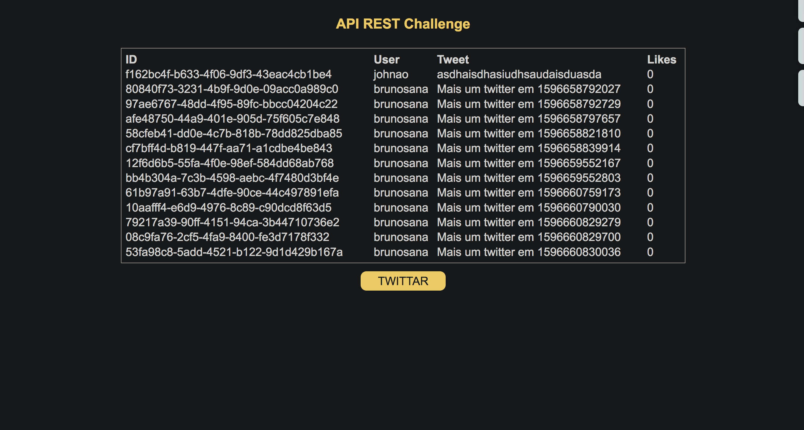

# Fake API REST ad React App for rocketseat bootcamp challenge 2

## Packages

- Express
- uuidv4
- cors
- nodemon (Dev Dependencie)
- axios
- react
- react-dom
- @babel/core
- @babel/preset-env
- @babel/preset-react
- babel-loader
- webpack
- webpack-cli
- webpack-dev-server (Dev Dependencie)
- style-loader
- css-loader
- @babel/plugin-transform-runtime (Dev Dependencie)

You can install packages typing on terminal: `yarn add express uuidv4 cors `... and `yarn add nodemon -D`...

## Run API

To run the API just type on terminal on backend folder: `yarn dev`
To run the React App just type on terminal on frontend folder: `yarn dev`

